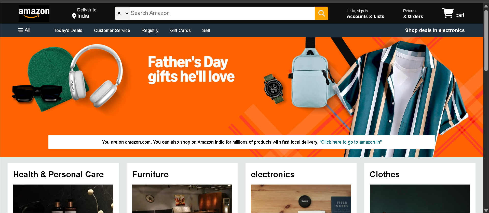

# 🛒 Amazon Clone (HTML + CSS)

This is a **static clone** of the Amazon homepage built using **pure HTML and CSS**. It was created as part of my learning journey to strengthen my frontend development skills, especially in layout design, CSS Flexbox/Grid, and responsive web design.

## 🚀 Features

- Clean and structured layout inspired by the official Amazon website
- Fully responsive design (works well on various screen sizes)
- Header with logo, search bar, and navigation links
- Hero section with promotional banner
- Product grid with hover effects
- Footer with multiple link sections

## 🛠️ Tech Stack

- HTML5
- CSS3 (Flexbox, Grid, Media Queries)

## 📸 Screenshots

 >

## 💡 What I Learned

- Structuring a real-world webpage layout with semantic HTML
- Implementing responsive design using CSS Flexbox and Grid
- Recreating a popular UI using only frontend tools
- Improving attention to detail by mimicking the look and feel of a real product

## 🔗 Live Demo

👉 [View Live Demo](https://yourusername.github.io/amazon-clone/)  
*(Replace the above URL with your actual GitHub Pages link)*

## 🙋‍♀️ About Me

I’m a passionate aspiring frontend developer constantly learning and building projects to improve my skills.

- 💼 [LinkedIn](https://linkedin.com/in/your-profile)
- 💻 [GitHub](https://github.com/yourusername)

